# 一.实验要求

完成“教学事务管理系统”，具体要求如下：

> 系统必须是在B/S架构下实现，用华为云服务器共享数据库。
>
> 数据库在原理1的School数据库基础下自行修改，只能添加，不能删除。
>
> 系统具有为不同的角色（**系统管理员**、**教师**、**学生**）提供不同操作权限的功能。
>
> 系统为系统管理员提供具有学分制教务管理特色的各类功能。
>
> 学生根据每个学期所开设的课程进行自主选课（生成课表）并具有查询有关信息的功能。
>
> 教师根据学生所选课程进行成绩（平时、考试）登录并且具有日常教学管理的功能。
>
> 系统为不同的角色提供各类统计分析。
>
> 数据库中至少包含一个触发器和一个存储过程在系统中使用和调用。
>
> 数据库可以是SQL Server、MYSQL、Oracle等。
>
> 其他辅助功能。

# 二.实验原理

​		**B/S架构**（Browser/Server Architecture）是一种计算机系统或软件应用程序的架构模式，其中浏览器（Browser）和服务器（Server）是系统的两个主要组成部分。在B/S架构中，用户通过Web浏览器（如Chrome、Firefox等）作为客户端与远程服务器进行交互。浏览器作为客户端提供了用户界面，用户可以通过它来发送请求、浏览网页、填写表单、上传下载文件等操作。服务器是B/S架构的核心组件，它接收来自浏览器的请求，执行相应的处理逻辑，并向浏览器返回响应。服务器负责处理用户请求、管理数据和业务逻辑，并将生成的HTML、CSS、JavaScript等前端资源发送给浏览器。

​		本次实验中，使用**VUE2+Springboot**实现学生选课系统，Vue负责前端用户界面的构建，Spring Boot负责后端业务逻辑的实现和数据处理。Vue发送HTTP请求到后端接口获取数据，后端返回JSON格式的数据给前端，通过Result接口将Vue和Spring Boot连接起来，前后端之间的数据交互变得简单和统一。通过这种前后端分离使得项目可以独立开发和部署，利用springboot将后端架构设计好之后，小组成员可以分别设计自己所需要的页面，并根据需要对后端进行修改。

​		**Vue**用于构建用户界面，被设计成渐进式框架，它的核心库专注于视图层（View Layer）的构建，可以与现有的项目或其他库进行集成。Vue通过采用组件化的开发方式，提供了一种灵活且高效的方式来构建可复用的UI组件。Vue使用双向绑定机制，可以轻松地将数据和视图进行绑定。当数据发生变化时，视图会自动更新，反之亦然。Vue将应用程序划分为一个个可重用的组件，每个组件拥有自己的模板、逻辑和样式。组件可以嵌套使用，形成复杂的应用程序。

​		**MyBatis**是一个开源的持久层框架，用于在Java应用程序中简化数据库访问的过程。它提供了一种将数据库操作与Java对象之间进行映射的方式，同时支持灵活的SQL查询和结果映射。MyBatis的核心原则是将SQL语句与Java代码进行解耦，通过XML文件或注解的方式来定义和配置SQL映射关系。这样可以使开发者专注于业务逻辑的实现，而无需关注底层的数据库操作细节。MyBatis-Plus是一个基于MyBatis的开源持久层框架，提供了一套增强的功能和工具，简化了MyBatis的使用和开发过程。MyBatis-Plus在MyBatis的基础上进行了扩展，提供了更便捷的CRUD操作、代码生成、分页查询、逻辑删除、性能优化等功能，极大地提高了开发效率和代码质量。通过在Springboot项目中配置Mybatisplus，可以很方便地对数据库进行各种操作，并以此来实现各种功能。

# 三.功能模块设计

## 1.管理员模块

1. 系统管理

- 学院信息管理（学院信息的增删改查）
- 教师信息管理（教师信息的增删改查）
- 学生信息管理（学生信息的增删改查）

> 管理员可以修改学生和教师的密码（密文显示，明文修改）

> 管理员可以添加学生和教师，并且设置默认的登录密码，然后学生和教师登录之后添加相应的信息，并且可以进行修改。

2. 课程管理

- 课程信息（课程相关信息增删改查以及课程信息导出功能）
- 开课信息（可以给课程分配老师和地点为其开课）

## 2.学生模块

- 学生选课；

- 退课；
- 课表查询；
- 课程表显示
- 课程查询

## 3.教师模块

- 查看自己本学期所教授的课程，并有一个课程表直观看到上课时间
- 针对每节课能够查看选择本门课程的学生的所有的信息（提供导出学生名单功能，检索功能）
- 登记分数功能，针对每一位学生提供录入成绩的功能，**平时成绩、考试成绩、最终成绩、绩点（最终成绩和绩点是由存储在数据库中的触发器自动根据平时成绩和考试成绩决定的）**
- 导出学生成绩表

# 四.数据库设计

## 1.登录涉及表格

登录涉及的身份表包括**管理员信息表、学生信息表、教师信息表**

> avatarurl标识用户的头像，存储的是图片的路径
>
> Musername为用户名
>
> Mpassword为长度32的字符串，存储加密后的用户密码。

**管理员信息表（manager)**：

| Mnumber | Musername |            Mpassword             | Mname |                          avatarurl                           |
| :-----: | :-------: | :------------------------------: | :---: | :----------------------------------------------------------: |
|    1    |   aimin   | 117f5560a7e3dfffff283ef55b639d20 | 艾敏  | http://124.71.166.37:9090/file/3b5b88f55f5b46de87398d63c58c9284.jpg |
|    2    |  luohao   |              luohao              | 罗浩  |                                                              |

**学生信息表(student)**：

> Studentid为学生编号，logn为用户名，pswd为密码，Sprofession为学生所在专业。

| studentid |  name  | sex  | dataofbirth | mobilephone | Status |    logn     |               pswd               |   Sprofession    | age  | nativeplace |                          avatarurl                           |
| :-------: | :----: | :--: | :---------: | :---------: | :----: | :---------: | :------------------------------: | :--------------: | :--: | :---------: | :----------------------------------------------------------: |
| 20121331  | 周鹏飞 |  男  |  2002/10/1  | 13994398510 |        | zhoupengfei | f1a6aefd531eec0f7420aa1e9f252baa | 计算机科学与技术 |  22  |    山西     | http://124.71.166.37:9090/file/b6b5a78db5be43728bf68af6a15e2c91.png |
| 20121332  | 张有临 |  男  |             | 13283687758 |        | zhangyoulin | 2a20bb27e97082c499cee77f386673e4 | 计算机科学与技术 |      |             |                                                              |
| 20121333  | 李洪辰 |  男  | 2001/12/27  | 13847473985 |        | lihongchen  | 907f5174e36e7f7d3dbdfbb9b394e6ae | 计算机科学与技术 |  22  |    湖南     |                                                              |

**教师信息表(teacher)**：

> 主键Tnumber
>
> 外键Tcollege联系到department表的deptid

| Tnumber | Tname  | Tsex | Tbirthday  | Tstatus | Twage | Tcollege |  Tusername  |            Tpassword             |                          avatarurl                           |
| :-----: | :----: | :--: | :--------: | :-----: | :---: | :------: | :---------: | :------------------------------: | :----------------------------------------------------------: |
|  10023  |  刘洋  |  女  | 1986/5/20  | 副教授  | 10000 |    2     |   liuyang   | 6b649039a388694c7306cb4d14041a14 |                                                              |
|  10025  | 李晓强 |  男  | 1986/10/15 | 副教授  | 15000 |    2     | lixiaoqiang | ae293c82715399f180ab1f60ee064b43 |                                                              |
|  10086  | 宋安平 |  男  | 1971/6/19  | 副教授  | 10000 |    2     | songanping  | 3bbf65e2908718af8538115d74349820 | http://124.71.166.37:9090/file/dc79ff13bdba4a409917b1c47bbc8f29.jpg |

## 2.学院表(department)和专业表（profession)

> **学院表**
>
> 主键：deptid

| deptid | deptname   | address   | phonecode   |
| ------ | ---------- | --------- | ----------- |
| 1      | 文学院     | 东区1号楼 | 3102312390  |
| 2      | 计算机学院 | 东区2号楼 | 31048392482 |

> **专业表**
>
> 主键：Pname
>
> 外键：Anumber联系到department的deptid

| Pname    | Pnumber | Anumber |
| -------- | ------- | ------- |
| 人工智能 | 204     | 2       |
| 大数据   | 302     | 3       |

## 3.课程信息表(lesson)

> 主键：Lnumber
>
> 外键：(Lcollege)->department(deptid)

| Lnumber | Lname            | Lcredit | Lcollege | gradeindex |
| ------- | ---------------- | ------- | -------- | ---------- |
| 10032   | 大学语文         | 6       | 1        | 37         |
| 20111   | 面向对象程序设计 | 4       | 2        | 46         |

## 4.开课表（sclass)

> 主键：(Tnumber,Lnumber,semester)
>
> 外键：(Lnumber)->lesson(Lnumber)
>
> ​			(Tnumber)->teacher(Tnumber)

| Tnumber | Lnumber | semester | lessontime    | classroom | maxsize | currentsize |
| ------- | ------- | -------- | ------------- | --------- | ------- | ----------- |
| 10023   | 20111   | 22年冬季 | 二1-2，四1-2  | 计208     | 60      | 9           |
| 10023   | 20123   | 22年冬季 | 一7-8，三9-11 | DJ103     | 40      | 8           |

## 5.选课表（lessonchoose)

> 主键：（snumber,Tnumber,semester,Lnumber)
>
> 外键：(Lnumber)->lesson(Lnumber)
>
> ​			(snumber)->student(studentid)
>
> ​			(Tnumber)->teacher(Tnumber)

| snumber  | Lnumber | Tnumber | psgrade | ksgrade | totalgrade | GPA  | semester |
| -------- | ------- | ------- | ------- | ------- | ---------- | ---- | -------- |
| 20121331 | 20111   | 10023   |         |         |            |      | 22年冬季 |
| 20121331 | 20123   | 10086   | 70      | 99      | 84         | 3.3  | 22年冬季 |

## 6.文件存储表（sys_file)

此表用于存储上传的头像文件等在服务器中的存储路径，文件存储在服务器对应的路径中。

> 主键：id

| id   | name      | type | size | url                                                          | is_delete | enable | md5                              |
| ---- | --------- | ---- | ---- | ------------------------------------------------------------ | --------- | ------ | -------------------------------- |
| 35   | jery.jpg  | jpg  | 11   | http://124.71.166.37:9090/file/8a3dc61e445e41678368b2eb166b4140.jpg | 0         | 1      | a2494faa6a84be9edf45158783e7d6f6 |
| 36   | aaaaa.jpg | jpg  | 27   | http://124.71.166.37:9090/file/b4cc0cce3ed14e67bae4a3f9c287f7be.jpg | 0         | 1      | f61253065eb701704768650bc16b6f8e |

## 7.触发器设置

### 7.1教师登分触发器设置：

~~~sql
DELIMITER $$
create trigger tri_update_score before update on lessonchoose for each row
    BEGIN
        DECLARE total_marks FLOAT; #总分
        DECLARE grade_point FLOAT; #绩点
        DECLARE ps_mark FLOAT;
        DECLARE exam_mark FLOAT;
        DECLARE ps_weightage INT;
        DECLARE exam_weightage INT;

        SELECT SUBSTR(gradeindex, 1, 1), SUBSTR(gradeindex, 2, 1) INTO ps_weightage, exam_weightage
        FROM lesson
        WHERE Lnumber = NEW.Lnumber;

        SET ps_mark = NEW.psgrade;
        SET exam_mark = NEW.ksgrade;

        SET total_marks = (ps_mark * ps_weightage / 10) + (exam_mark * exam_weightage / 10);

        IF total_marks >= 90 THEN SET grade_point = 4.0;
        ELSEIF total_marks >= 85 THEN SET grade_point = 3.7;
        ELSEIF total_marks >= 82 THEN SET grade_point = 3.3;
        ELSEIF total_marks >= 78 THEN SET grade_point = 3.0;
        ELSEIF total_marks >= 75 THEN SET grade_point = 2.7;
        ELSEIF total_marks >= 72 THEN SET grade_point = 2.3;
        ELSEIF total_marks >= 68 THEN SET grade_point = 2.0;
        ELSEIF total_marks >= 64 THEN SET grade_point = 1.5;
        ELSEIF total_marks >= 60 THEN SET grade_point = 1.0;
        ELSEIF total_marks >= 0 THEN SET grade_point = 0.0;
        END IF;

        SET NEW.totalgrade = total_marks;
        SET NEW.GPA = grade_point;
    END; #分号要有
$$
DELIMITER ;  #再将分号声明
~~~

创建了一个名为"tri_update_score"的触发器。在"lessonchoose"表进行更新操作之前触发。这个触发器根据给定的课程计算总分和绩点，并相应地更新"lessonchoose"表中的"totalgrade"和"GPA"字段。

首先，该触发器声明了一些变量，包括"total_marks"，"grade_point"，"ps_mark"，"exam_mark"，"ps_weightage"和"exam_weightage"。其中，"ps_mark"和"exam_mark"变量分别设置为正在更新的行中的"psgrade"和"ksgrade"字段的值。而"ps_weightage"和"exam_weightage"即平时分和考试分权重变量则通过使用"SUBSTR"函数从相应的"lesson"行中的"gradeindex"字段中获取。

接下来，该触发器通过将"ps_mark"和"exam_mark"分别与其权重相乘，来计算"total_marks"。

然后，该触发器使用一系列"IF"语句根据之前计算的"total_marks"来设置"grade_point"变量。最后，该触发器使用计算出的值更新"lessonchoose"表中的"totalgrade"和"GPA"字段。

"DELIMITER"语句用于将分隔符从";"更改为"$$"。这是必要的，因为触发器定义包含";"字符，否则会提前终止语句。在触发器定义的末尾，使用另一个"DELIMITER"语句将分隔符更改回";"。

### 7.2学生选课触发器

~~~mysql
CREATE TRIGGER InsertLessonChoose
BEFORE INSERT ON lessonchoose
FOR EACH ROW
BEGIN
    DECLARE current_size INT;
    DECLARE max_size INT;
    
    SELECT currentsize INTO current_size FROM sclass WHERE Lnumber = NEW.Lnumber AND Tnumber = NEW.Tnumber And semester = NEW.semester;
    SELECT maxsize INTO max_size FROM sclass WHERE Lnumber = NEW.Lnumber AND Tnumber = NEW.Tnumber And semester = NEW.semester;
    
    IF current_size >= max_size THEN
        SIGNAL SQLSTATE '45000' SET MESSAGE_TEXT = 'The current class size has reached the maximum capacity';
    END IF;
END;
~~~

为了实现当选课过程中，选课人数将要超过最大人数的时候，进行相应处理。对此，设计了一个名为"InsertLessonChoose"的触发器。在该触发器中，针对的变量是"current_size"和“max_size”。

**触发时点：**

每当选课的时候，也就是对"lessonchoose"表进行插入操作的时候，该触发器会自动进行判断。触发器会在"sclass"表中，进行搜索，获取当前课程的最大容量和当前选课人数，然后进行对比。如果当前人数已经选满，则拒绝进行插入操作，并返回错误信息。反之，则会进行插入操作。

## 8.存储过程设置

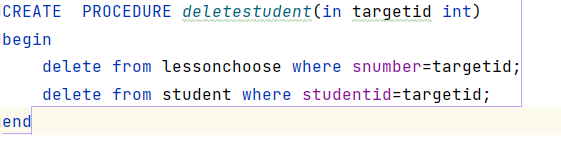

在**数据库管理**过程中，如果删除某个学生，则会触发数据库的级联保护从而报错，因此通过设置一个存储过程来实现。

创建名为deletestudent的存储过程，该存储过程传入一个int型targetid参数，在调用该存储过程时，首先将lessonchoose表中学生号为targetid的记录全部删除，之后再将student表中studentid为targetid的学生删除。无须修改数据库的级联删除设置即可安全删除相关数据。

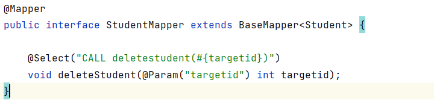

在studentmapper中使用@Select注解调用这个存储过程，之后再controller层中可以使用studentmapper中的deletestudent函数执行这一存储过程。

# 五.运行结果展示

## 1.登录页面

- 根据输入的账号密码分别进入三个信息表去检索，如果检索到相应的身份则进入相应的管理系统中。

- 在此密码是我们输入的明文，后台进数据库检索前会对密码进行md5加密，然后去校验密码是否与数据库中的密文密码匹配。

- 账号密码如果匹配正确，后端会根据账号密码生成一个token值存储在浏览器的响应头中（浏览器内不会直接存储明文密码），在之后进入到管理系统内去请求各个接口数据时，后端都会去验证响应头的token是否正确或者过时，只有当token验证成功的时候才会返回请求的数据。

## 2.教师用户界面

### 2.1主页

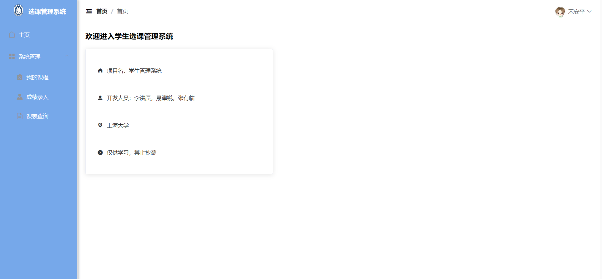

- 侧边栏可以选择相应的功能：**我的课程、成绩录入、课表查询**

- 头部栏有收缩侧边栏的按钮，可以显示当前页面的面包屑，和查看个人信息以及退出登录的下拉框。

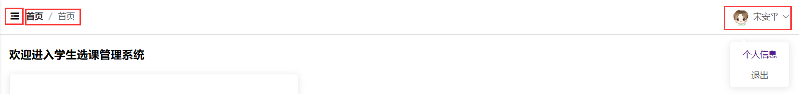

### 2.2个人信息页面

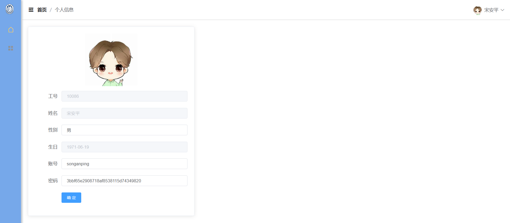

个人信息页中可以修改相关信息，如上传头像和修改账号密码等

在此密码显示的是数据库加密后的密文，如果想要修改密码直接在其输入框中输入要修改的值，点击确定就修改成功。此时后台会对我们输入的密码进行md5加密再保存到数据库中。如果没有修改密码点击确定，系统也不会对此密文进行重复加密。

### 2.3我的课程

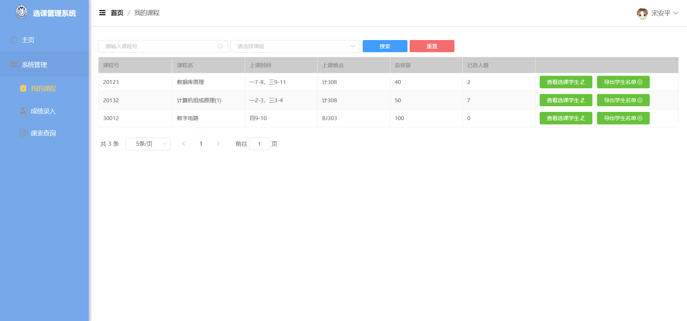

> 此页面可以看到这个教师开了哪些课，并且在搜索框中可以根据课程号搜索课程，或者在选择课程下拉框内选择此教师

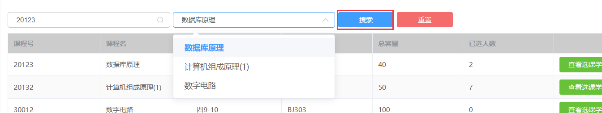

> 教师可以查看选择指定课程的所有学生信息：

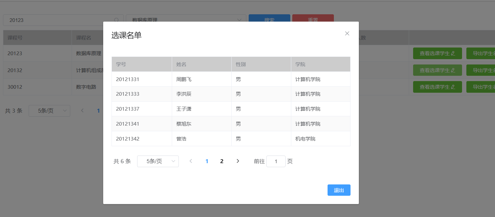

> 教师可以导出指定课程的学生名单：

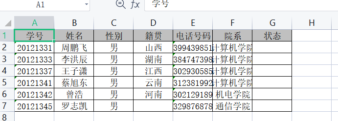

### 2.4成绩录入界面

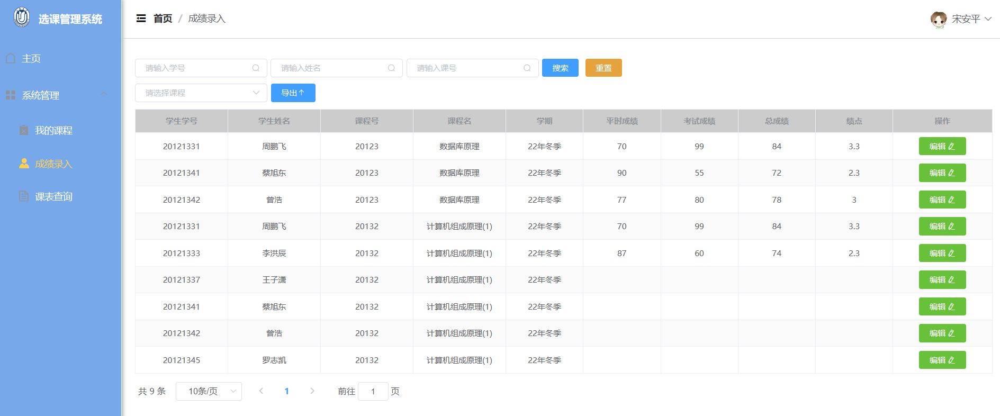

>  在此页面中可以登记所有选择此教师所开的课程的学生成绩，并且在上面的搜索栏中可以根据学生号、学生姓名、课号进行搜索。
>
> 并且有个下拉选项框，可以分类登记每节课的学生成绩

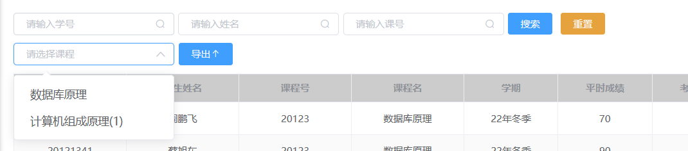

> 选择一个课程后，可以编辑每个学生的成绩

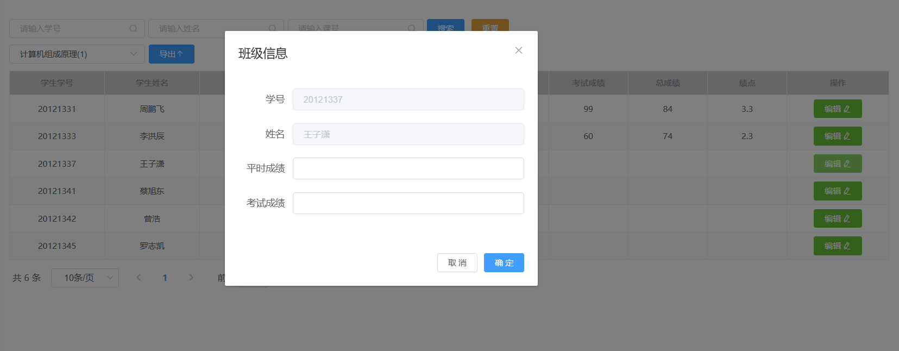

>  只需输入平时成绩与考试成绩，数据库中的触发器就能根据这两个成绩自动去计算总成绩和绩点，并将他们保存进数据库中。

> 点击导出按钮，就可将选择的课程的所有学生成绩进行导出，若未筛选课程，则将表格中的第一行课程内的所有学生成绩进行导出。

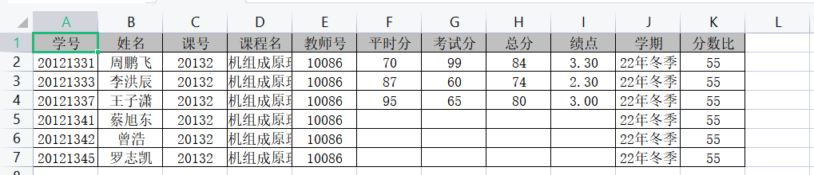

### 2.5课表查询页面

> 此页面可以看到教师所教授的课程的信息，并且有个课程表可以看到上课时间和地点

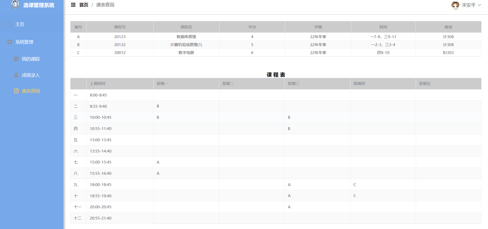

# 六.困难

这里记录在开发过程中遇到的主要困难，对其解决思路和办法等

## 1.多表查询

在管理系统中为了将表展示出来，我在后台设置了entity实体类包，用于存储映射数据库中的每一个表。但是我们的需求并不是单单把一个表的内容存入到entity实体列表返回给前端，因为有些数据在其中单个一个表中是不完全的，需要把各个表给结合起来的数据返回给前端。

> entity包：

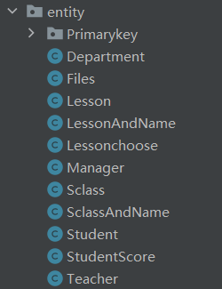

### 方法一：

例如教师端中的成绩录入表：

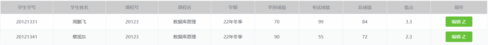

该表涉及到数据库中许多表内的信息，我们先看数据库中的选课表（lessonchoose)：

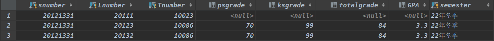

和前端展示的成绩录入表对比一下就能发现，该表缺少了学生姓名信息，课程名信息，因此单返回lessonchoose表的内容是不合适的。

我需要将学生表（student）的学生姓名信息和课程表的（lesson）的课程名传进来。这就一定会涉及到多表查询，需要根据选课表的外键（snumber)和(Lnumber)分别进入到student表和lesson表去查询相应的信息。

于是我想到的第一种方法就是在entity包中创建一个新的entity实体类：StudentSocre。

> StudentScore实体类：

~~~java
public class StudentScore {
    private Integer snumber;

    private String sname;       //

    private Integer lnumber;
    private String lname;      //课程名
    private Integer tnumber;

    private Integer psgrade;

    private Integer ksgrade;

    private Integer totalgrade;

    private Float gpa;

    /**
     * 90～100 A 4.0
     *
     * 85～89.9 A- 3.7
     *
     * 82～84.9 B+ 3.3
     *
     * 78～81.9 B 3.0
     *
     * 75～77.9 B- 2.7
     *
     * 72～74.9 C+ 2.3
     *
     * 68～71.9 C 2.0
     *
     * 66～67.9 C- 1.7
     *
     * 64～65.9  D 1.5
     *
     * 60～63.9 D- 1.0
     *
     * ＜60 F 0
     */

    private String semester;

    private Integer gradeindex;    //平时分考试分成绩比

    public StudentScore(Lessonchoose lessonchoose,String sname,String lname,Integer gradeindex)
    {
        this.snumber=lessonchoose.getSnumber();
        this.sname=sname;
        this.lnumber=lessonchoose.getLnumber();
        this.lname=lname;
        this.tnumber=lessonchoose.getTnumber();
        this.psgrade=lessonchoose.getPsgrade();
        this.ksgrade=lessonchoose.getKsgrade();
        this.totalgrade=lessonchoose.getTotalgrade();
        this.gpa=lessonchoose.getGpa();
        this.semester=lessonchoose.getSemester();
        this.gradeindex=gradeindex;
    }

}
~~~

里面存储这些属性和一个初始化函数。我们发现这些属性和我在前端展示在表中的列名都是一样的，因为我们就是要把我们所需要的内容全都注入到这个实体类中，再返回给前端，前端再去展示这些数据，于是我们的目的就达到了。

但是去每个数据库表查询数据并把数据整合在一起的操作全是在后端Controller里面做的，虽然目的达到了，但是代码极其臃肿复杂，不易理解。于是上网搜寻资料查到了另一种方法。

> 整合代码部分：

~~~java
        //根据条件构造器去查询
        List<Lessonchoose> lessonchooses=lessonchooseService.list(queryWrapper);

        List<StudentScore> result = new ArrayList<>();
        Lesson lesson;
        Student student;
        //随后，遍历查找到的数据，针对每一行，也就是每一个课程找到课程的课程名称和课程学分还有学生的姓名
        for(Lessonchoose o:lessonchooses){
            //根据课号查询课名、分数比等
            QueryWrapper<Lesson> lessonQueryWrapper = new QueryWrapper<>();
            lessonQueryWrapper.eq("lnumber",o.getLnumber());
            lesson=lessonService.getOne(lessonQueryWrapper);

            //根据学生号查询姓名
            QueryWrapper<Student> studentQueryWrapper=new QueryWrapper<>();
            studentQueryWrapper.eq("studentid",o.getSnumber());
            student=studentService.getOne(studentQueryWrapper);

            StudentScore studentScore=new StudentScore(o,student.getName(),lesson.getLname(),lesson.getGradeindex());

            result.add(studentScore);
        }
~~~

### 方法二：

例如教师端的我的课程页面中，点击查看选课学生按钮会跳出已经选择本门课的所有学生：

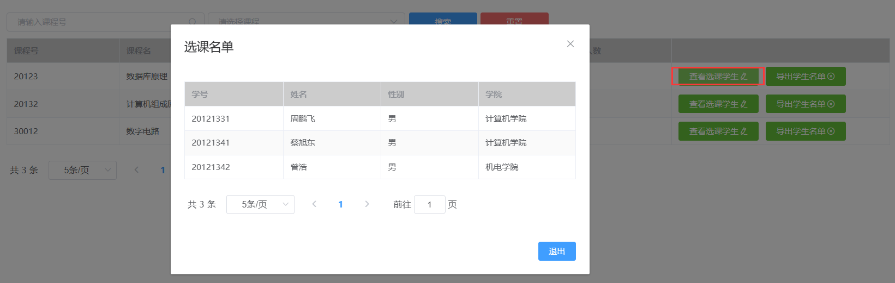

这个简单的操作蕴含着多表查询的功能，因为我们需要把当前教师的教师信息（教师号）传进去，点击的此行的课程信息（课程号）传进去，根据这两个信息去选课表中查询出选择此老师开的这门课的所有学生学号，根据这个学号去学生信息表中查询出这些学生的信息。因此该sql语言应该为：

~~~sql
select s.studentid, s.name, s.sex, d.deptname  as departName
        from lessonchoose
        join student s on lessonchoose.snumber = s.studentid
        join profession p on s.Sprofession = p.Pname
        join department d on p.Anumber = d.deptid
        where lessonchoose.Tnumber=#{tnumber} and lessonchoose.Lnumber=#{lnumber}
~~~

此sql语言就能很好的满足我们的查询需求。

> 注意：学生信息表中是不包含学院名的，存储的只是外键学院号，因此此步也涉及到多表联结查询

查询出的结果必须作为一个对象返回给前端，之前我说过不会再新建一个entity实体类来存储信息了，因此这个方法为在student实体类中新增加一个departName属性:

~~~java
    @TableField(exist = false)
    private String departName;
~~~

> @TableField(exist = false)非常重要，因为此表是映射数据库中student表的，每一个属性都对应着数据库中的每一列，不能随便增加属性，这个注解的作用就是在映射时忽略此属性的映射

因此查询结果就存储在student类对象中，然后返回给前端。

实际操作方式为：

> 教师端调用某个接口查询选择某一节课的所有的学生信息，传入相应的参数（课程号和教师号）

~~~java
    @GetMapping("/getClassStudents")
    public Result getClassStudents(@RequestParam Integer pageNum,
                                   @RequestParam Integer pageSize,
                                   @RequestParam (defaultValue = "")Integer tnumber,
                                   @RequestParam (defaultValue = "")Integer lnumber){
        Page<Student> page=lessonchooseService.getClassStudents(new Page<>(pageNum,pageSize),tnumber,lnumber);
        return Result.success(page);
    }
~~~

>  调用lessonchooseService中的getClassStudents方法：

~~~java
Page<Student> getClassStudents(Page<Object> page, Integer tnumber, Integer lnumber);
~~~

> 此方法只是一个接口，具体实现在LessonchooseServiceImpl中：

~~~java
    @Override
    public Page<Student> getClassStudents(Page<Object> page, Integer tnumber, Integer lnumber) {
        return lessonchooseMapper.getClassStudents(page,tnumber,lnumber);
    }
~~~

>  最后调用实际SQL映射文件lessonchooseMapper中的方法getClassStudents：

~~~java
    Page<Student> getClassStudents(Page<Object> page, @Param("tnumber")Integer tnumber,@Param("lnumber") Integer lnumber);
~~~

>  调用上面存在LessonchooseMapper.xml中的sql语句去数据库中查询数据并返回存储到student对象中。

## 2.自动计算总分和绩点

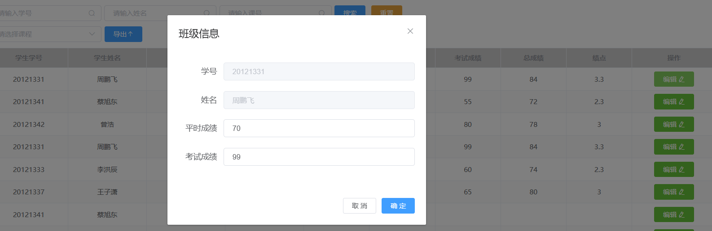

在未学习触发器之前，为了实现此功能，只能在点击确定按钮，在后端保存接口中去判断是否输入了平时成绩和考试成绩，再去查询此课程的平时分考试分比例去计算总分和绩点。

~~~java
if(s.getPsgrade()!=null&&s.getKsgrade()!=null){
            float psindex=(float)(s.getGradeindex()/10)/10;    //平时分占比，如0.4
            float ksindex=(float)(s.getGradeindex()%10)/10;    //考试分占比，如0.6
            s.setTotalgrade((int)(s.getPsgrade()*psindex+s.getKsgrade()*ksindex));
            if(s.getTotalgrade()>=90&&s.getTotalgrade()<=100)
            {
                s.setGpa(4.0F);
            } else if (s.getTotalgrade() >= 85 && s.getTotalgrade() <= 89) {
                s.setGpa(3.7F);
            } else if (s.getTotalgrade() >= 82 && s.getTotalgrade() <= 84) {
                s.setGpa(3.3F);
            } else if (s.getTotalgrade() >= 78 && s.getTotalgrade() <= 81) {
                s.setGpa(3.0F);
            } else if (s.getTotalgrade() >= 75 && s.getTotalgrade() <= 77) {
                s.setGpa(2.7F);
            } else if (s.getTotalgrade() >= 72 && s.getTotalgrade() <= 74) {
                s.setGpa(2.3F);
            } else if (s.getTotalgrade() >= 68 && s.getTotalgrade() <= 71) {
                s.setGpa(2.0F);
            }else if (s.getTotalgrade() >= 66 && s.getTotalgrade() <= 67) {
                s.setGpa(1.7F);
            }else if (s.getTotalgrade() >= 64 && s.getTotalgrade() <= 65) {
                s.setGpa(1.5F);
            }else if (s.getTotalgrade() >= 60 && s.getTotalgrade() <= 63) {
                s.setGpa(1.0F);
            }else if (s.getTotalgrade() < 60) {
                s.setGpa((float) 0);
            }
        }

        Lessonchoose lessonchoose=new Lessonchoose(s.getSnumber(),s.getLnumber(),s.getTnumber(),s.getPsgrade(),s.getKsgrade(),s.getTotalgrade(),s.getGpa(),s.getSemester());
~~~

此功能是实现了，但是也是增加了代码量。再学习了触发器之后，发现此功能原来在数据库中就可以实现，于是查询了相关资料写了一个tri_update_score触发器来实现输入平时分和考试分后自动计算考试分和绩点并保存进数据库中。

# 七.心得体会

​		当我开始开发这个选课管理系统时，我并没有预料到自己会得到这么多宝贵的经验。这个项目让我对Spring Boot和Vue.js有了更深入的理解，同时也加强了我的数据库技能和项目管理技能。

​		首先，这个项目让我意识到了良好的架构设计的重要性。在开始编码之前，我们花了一些时间仔细规划了整个系统的架构。我们采用了分层架构，将前端和后端分离开来，使用Spring Boot作为后端框架，Vue.js作为前端框架。这种架构的好处是明确的职责分离，提高了代码的可维护性和可扩展性。

​		其次，数据库的设计和规范是一个成功项目的基础。我们在项目初期花费了大量时间来分析需求和设计数据库结构。我们仔细考虑了表的关系、字段的定义和索引的优化，以确保数据库能够满足项目的需求，并且能够高效地处理数据的增删改查操作。

​		其次，我学会了如何处理后端与前端的数据交互。通过使用Spring Boot提供的RESTful API，我能够轻松地实现数据的传输和交换。同时，我还学会了使用Axios库在前端与后端进行异步通信。这种前后端分离的开发模式让系统更加灵活和可扩展。

​		此外，我还学会了如何进行错误处理和异常处理。在开发过程中，我经常会遇到各种错误和异常情况，例如数据库连接失败、数据验证错误等。通过合理地使用日志记录和异常处理机制，我能够更好地定位和解决这些问题，提高了系统的稳定性和可靠性。

​		最后，我还学到了团队协作的重要性，让我充分意识到了一个好的团队可以带来巨大的收益。通过与团队成员进行交流和讨论，我得到了很多有价值的反馈和建议。这些团队合作的经验将对我未来的工作中也会有很大的帮助。

​		总的来说，这个选课管理系统项目是我宝贵的学习和成长机会。通过这个项目，我不仅深入了解了Spring Boot和Vue.js的开发，还提升了我的架构设计、数据交互、错误处理和团队协作能力。我相信这些经验将对我未来的项目有着重要意义。